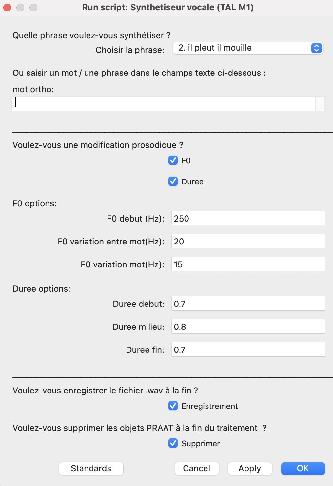

--------------------------------------------------------------------------
			   Synthèse vocale
--------------------------------------------------------------------------
Projet réalisé dans le cadre du cours Phonétique et synthèse de la parole.

Vous trouverez dans l'archive les fichiers suivants :
	-	script
	-	fichier wav
	-	fichier TextGrid
	-	fichier texte avec dico
	-	fichier texte README

Total de diphones enregistrés : 102

Version de Praat utilisé : 6.1.26 (MacOS)

---------------------------- I. MODE D'EMPLOI ----------------------------
Il y a plusieurs options à cocher dans la boîte de dialogue :

1.	Dans le menu déroulant, choississez la phrase à synthétiser OU
saissiser un ou plusieurs mots dans le champ

2.	Cochez "F0" pour faire la modification de la fréquence fondamentale. 
La F0 comporte les options : 
	—	fréquence de début de la phrase
	—	fréquence d'augmentation entre chaque mot jusqu'au verbe puis
		abaissement jusqu'à la fin de la phrase
	—	augmentation de la fréquence au millieu de chaque mot

3. Cochez "Duree" pour faire la modification de la durée.
La durée comporte les options : 
	—	durée au début de la phrase
	—	durée au milieu de phrase
	—	duree à la fin de la phrase

4. Cochez "Enregistrement" pour enregistrer le fichier son synthétisé : 
resultat.wav

5. Cochez "Supprimer" pour supprimer les objets Praat à la fin du traitement.

  

------------------- II. LES PHRASES / MOTS À SYNTHETISER ----------------
Dans le menu déroulant de la boîte de dialogue vous trouverez les phrases
que l'on peut synthétiser, celui-ci inclut :

	-	il pleut fort (par défaut)
	-	il pleut il mouille
	-	j'aime mes jouets
	-	notre village est joli
	-	les papillons volent au-dessus de la ville
	-	petit escargot porte sur son dos sa maisonnette
	-	aussitôt qu'il pleut il est tout heureux
	-	il sort sa tête
	-	sa tête est jolie

Ou vous pourrez bien synthétiser l'un de ces mots :

Mots grammaticaux : de, la, sur, son, sa, mon, ma, mes, notre, il, qu'il,
est, au-dessus, aussitôt

Mots lexicaux: dos, maison, maisonnette, papillon, ville, village, jouets, 
tête, petit, heureux, tout, fort, jolie, porte, pleut, mouille, vole, 
j'aime, vit 

--------------------------- III. DICTIONNAIRE ---------------------------
Le dictionnaire est crée à partir de la liste des phrases / mots ci-dessus.

Tous les non-ASCII caractères sont remplacés par les caractères ASCII de
la façon suivante :

	ə —> @
	ɛ —> E
	ɔ —> 0 (zéro)
	œ —> 9
	ø —> 2
	ɔ̃ —> O (o majuscule)
	ʁ —> R
	ʒ —> Z
